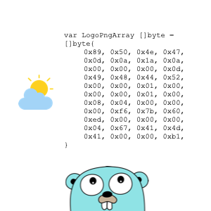

# go-bytefy

[](https://github.com/tiagomelo/go-bytefy/actions/workflows/test.yml)

[](https://pkg.go.dev/github.com/tiagomelo/go-bytefy)



A simple utility to encode a file (or any other data) into a Go byte slice.  
Handy for embedding binary assets directly in your Go code.

## installation

```
go install github.com/tiagomelo/go-bytefy/cmd/gobytefy@latest
```

This installs the binary into the `bin` directory of your `$GOPATH`.

Check it with:

```
go env | grep GOPATH
```

## CLI usage

To run `gobytefy` from any terminal, ensure your `$GOPATH/bin` is on your `$PATH`:

```
export PATH="$GOPATH/bin:$PATH"
```

### basic usage

```
gobytefy --package assets --file img.png --output assets/logo.go --id LogoPng
````

This generates a Go file `assets/logo.go` with the following structure:

```go
package assets

var LogoPng []byte = []byte{
	0x89, 0x50, 0x4e, 0x47, 0x0d, 0x0a, 0x1a, 0x0a,
	// ...
}
```

### full flags reference

| Flag              | Description                                        |
| ----------------- | -------------------------------------------------- |
| `-p`, `--package` | Go package name                                    |
| `-f`, `--file`   | Input file to encode as byte slice                  |
| `-o`, `--output`  | Output file path                                   |
| `-i`, `--id`      | Go identifier for the byte slice (e.g. `LogoPng`)  |

## unit tests

```
make test
```

## unit tests coverage

```
make coverage
```